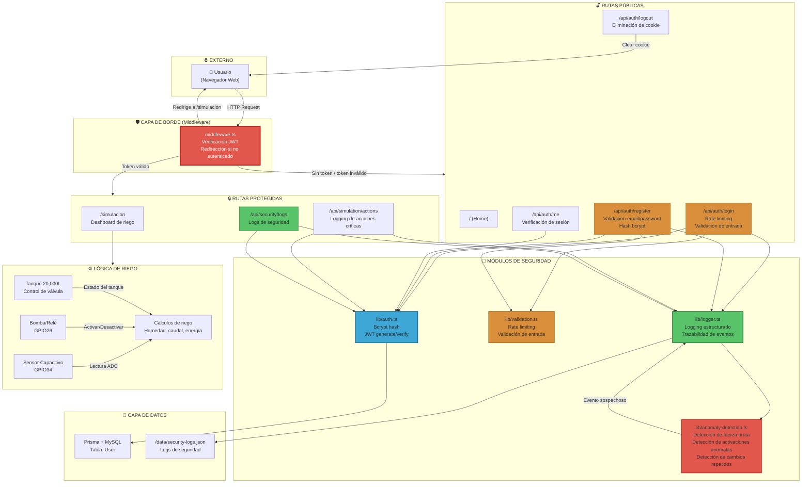
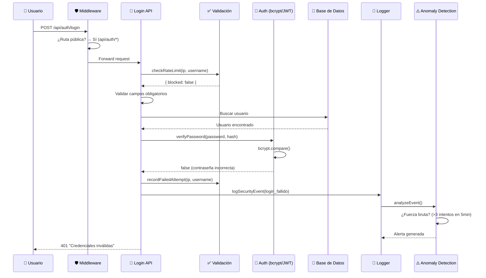
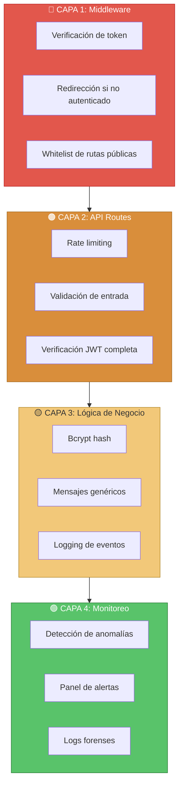

# Diagrama de Arquitectura con Enfoque Defensivo

## Sistema de Riego Automatizado ESP32 — Vista de Seguridad

---

## Puntos de Validación de Seguridad

| # | Punto | Ubicación | Principio Aplicado |
|---|-------|-----------|-------------------|
| 1 | **Middleware de autenticación** | `middleware.ts` | Defensa en profundidad — primera línea de defensa |
| 2 | **Rate limiting de login** | `lib/validation.ts` → `app/api/auth/login/` | Mitigación de fuerza bruta |
| 3 | **Validación de email** | `lib/validation.ts` → `app/api/auth/register/` | Validación de entrada |
| 4 | **Fortaleza de contraseña** | `lib/validation.ts` → `app/api/auth/register/` | Contraseñas fuertes |
| 5 | **Hash de contraseña (bcrypt)** | `lib/auth.ts` | Protección de credenciales |
| 6 | **Verificación JWT (firma + exp)** | `lib/auth.ts` → `app/api/auth/*/` | Integridad de tokens |
| 7 | **Cookie httpOnly + secure** | `app/api/auth/login/` | Mitigación XSS + CSRF |
| 8 | **Mensajes genéricos de error** | Todas las API routes | Prevención de enumeración |
| 9 | **Logging de eventos** | `lib/logger.ts` | Trazabilidad y auditoría |
| 10 | **Detección de anomalías** | `lib/anomaly-detection.ts` | Detección de intrusos |
| 11 | **Verificación server-side** | Todas las API routes protegidas | No confiar en el cliente |

---

## Flujo de Autenticación

---

## Diagrama de Capas de Seguridad

---

*Diagrama de arquitectura defensiva — Sistema de Riego Automatizado ESP32*
*Fecha: Agosto 2026*
